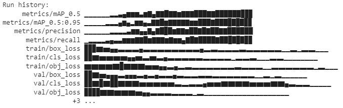
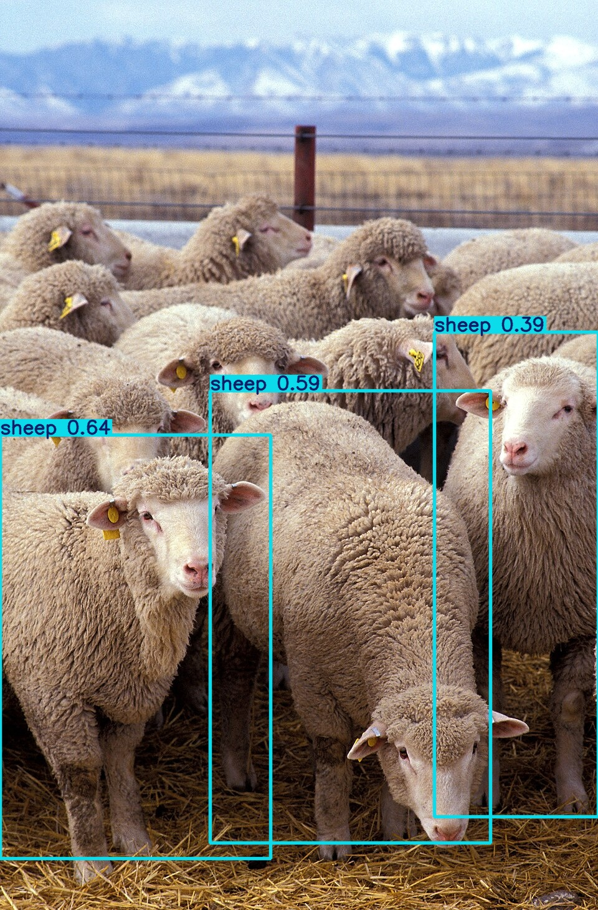
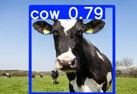

# FIAP - Faculdade de Informática e Administração Paulista

<p align="center">
  <a href="https://www.fiap.com.br/">
    
  </a>
</p>

## 👥 Grupo 25

## 👨‍🎓 Integrantes:

- Amanda Vieira Pires (RM566330)
- Ana Gabriela Soares Santos (RM565235)
- Bianca Nascimento de Santa Cruz Oliveira (RM561390)
- Milena Pereira dos Santos Silva (RM565464)
- Nayana Mehta Miazaki (RM565045)

## 👩‍🏫 Professores:

### Tutor(a)

- Lucas Gomes Moreira

### Coordenador(a)

- André Godoi

---

# **ENTREGA 1** 🌾 FarmTech Solutions - Projeto de IA para Agricultura

## 📋 Sobre o Projeto

O **FarmTech Solutions** é um projeto de Inteligência Artificial desenvolvido para a **Fase 6 do curso de Inteligência Artificial da FIAP**. 
Com o sucesso da implementação de soluções de IA para a otimização de plantações, a FarmTech Solutions expandiu sua atuação para além do agronegócio tradicional, abrangendo agora o setor de **saúde animal** e outros serviços estratégicos. O projeto visa a implementação do **método YOLO** para detectar e segregar objetos a fim de criar um sistema de visão computacional eficaz para uma análise prática e em tempo real, fornecendo insights acionáveis para otimizar a produtividade e garantir o melhor cuidado para seu rebanho, unindo o sucesso que já obtivemos no campo com a inovação no **manejo animal**. 

### 🎯 Objetivos

- **Dataset**: seleção de imagens separadas em treinamento, validação e teste.
- **Labels**: criação de labels nas imagens para identificação dos objetos
- **Arquitetura**: YOLO

### 📊 Dataset

**Pasta**: Cap_1
**Local**: Google drive
**Link**: https://drive.google.com/drive/folders/1WLe_Iwy2RCa5MSCHE2sDJgeLfuxUh-B9?usp=drive_link

# 🏗️ Estrutura do Projeto

```
chap1-phase06-farm-tech/
├── FarmTech_Solutions_YOLO.ipynb  # Google colab notebook
└── README.md                      # Este arquivo
```

# 🔄 Fluxo do Projeto

```
🎯 Dataset → 🔀 Detecção e Segmentação 
```

# Etapas Principais

**1. 🎯 Dataset** (Make sense IA: 2 labels)

**2. 🔀 Arquitetura** (YOLO)

# 🚀 Como Executar

## 1. **Pré-requisitos**

- Google Colab Notebook
- Google Drive
- Git

## 2. **Instalação**

```bash
# Clone o repositório
git clone https://github.com/fiap-ia-2025/chap1-phase06-farm-tech.git
```

# 3. **Execução**

1. Criação do Dataset no GoogleDrive: necessário clonar as pastas do Google Drive para seu próprio Drive.
2. Executar código do Google Colab Notebook

# 🛠️ Tecnologias e Dependências

## Tecnologias Utilizadas

- **Google Colab Notebook**: Ambiente de desenvolvimento
- **Google drive**: Armazenamento dados

# 📊 Dataset

Para iniciar o desenvolvimento do sistema de visão computacional, foram selecionados dois objetos principais: `Sheep` (Ovelha) e `Cow` (Vaca). <br>
A plataforma `Make Sense IA` foi utilizada para a crucial etapa de rotulagem (labeling). Neste processo, as imagens de ovelhas e vacas foram inseridas para que os labels fossem criados e, subsequentemente, identificados com precisão em cada imagem. Isso é fundamental para treinar o modelo a reconhecer cada animal. <br>

Para garantir um treinamento robusto e uma avaliação justa do modelo, foi separado um total de 40 imagens para cada animal. O conjunto de dados foi então dividido e organizado em pastas definidas no `Google Drive`, seguindo a distribuição padrão para aprendizado de máquina: <br>

**Treino**: 32 imagens (para o treinamento do modelo). <br>

**Validação**: 4 imagens (para ajuste fino do modelo durante o treinamento). <br>

**Teste**: 4 imagens (para avaliação do desempenho final do modelo). 

# 📈 Análise e Explicação do Código

O objetivo é treinar o modelo para identificar os objetos `cow` (vaca) e `sheep` (ovelha) utilizando a arquitetura YOLOv5 (You Only Look Once, versão 5) no ambiente Google Colab.

## 1. ⚙️ Conexão com o Google Drive

Os dados de treinamento (imagens e rótulos) estão armazenados na conta do Google Drive e por isso é necessária a sua conexão.

## 2. ⬇️ Baixar o Repositório YOLOv5 e Instalar Dependências 

O **YOLOv5** é um modelo de detecção de objetos de código aberto, portanto é possível baixar os arquivos da arquitetura e instalar todas as bibliotecas Python necessárias para que o treinamento e a detecção funcionem corretamente.

## 3. 📄 Configuração do Dataset

Para informar ao **YOLOv5** onde encontrar os conjuntos de imagens e quais classes (objetos) ele deve aprender a identificar é preciso criar um arquivo de configuração: `data.yaml`.

## 4. 🧠 Treinamento do Modelo

O treinamento ocorre em duas fases, usando diferentes números de épocas, **30 épocas e 60 épocas**, para que o modelo aprenda a detectar os objetos.

| Métrica | 30 Épocas | 60 Épocas | Comparação |  
| :--- | :---: | ---: | ---: |
| mAP@0.5 | 81,7% | 86,4% | A precisão na identificação dos objetos melhorou. |
| mAP@0.5:0.95 | 46,5% | 55,1% | A precisão na localização exata das caixas delimitadoras teve um avanço. |
| Precisão | 81,7% | 87,6% | Pouca mudança na taxa de acertos, porém ambas estão altas. |
| Recall | 80% | 84% | Melhoria de 4% para encontrar os objetos reais no conjunto de validação. |
| Loss Final | 0.0247 | 0.0163 | O valor de erros diminuiu, ou seja, o modelo aprendeu a cometer menos erros. |

**Para o treinamento de 60 Épocas:**



O gráfico apresentado é o Histórico de Execução gerado durante o treinamento do modelo de Visão Computacional **YOLOv5**, que tem como objetivo detectar `Cow` (Vaca) e `Sheep `(Ovelha) e verificar a evolução e a saúde do modelo ao longo das épocas de treinamento. <br>

As `metrics/mAP_0.5`, `metrics/mAP_0.5:0.95`, `metrics/precision` e `metrics/recall` são **métricas de performance** para indicar a capacidade do modelo de acertar as detecções do conjunto de validação. A tendência clara de crescimento nessas barras aponta para um aprendizado bem-sucedido. <br>

As `train/box_loss`, `val/box_loss`, `train/cls_loss`, `val/cls_loss`, `train/obj_loss` e `val/obj_loss` são **métricas de perda** para mostrar o grau de erro do modelo. A tendência ideal é a de queda progressiva indicando que o modelo está ajustando seus pesos e diminuindo seus erros a cada época.

## 5. ✅ Validação do Teste

Ocorre a capacidade de detecção do modelo, utilizando imagens que ele nunca viu antes.





As imagens representam o resultado e a eficácia do modelo YOLOv5 treinado. As caixas delimitam os animais e os números indicam o nível de confiança da detecção do modelo. <br>
Os resultados indicam o sucesso do treinamento com altos níveis de confiança na identificação de `cow` e `sheep` em diferentes posições, raças e ambientes.

# 🎬 Vídeo 

Link para vídeo do Youtube: https://youtu.be/ASjsuGd0Lrs